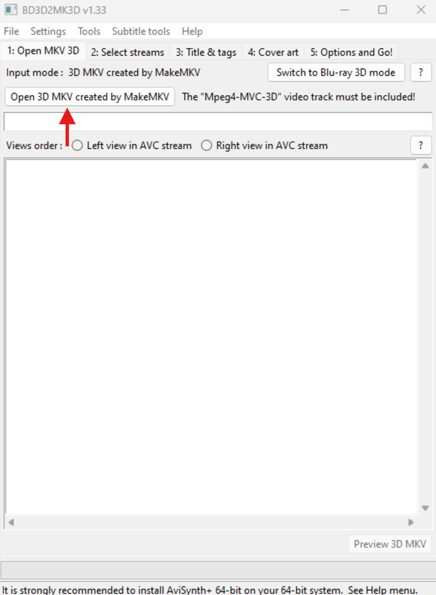
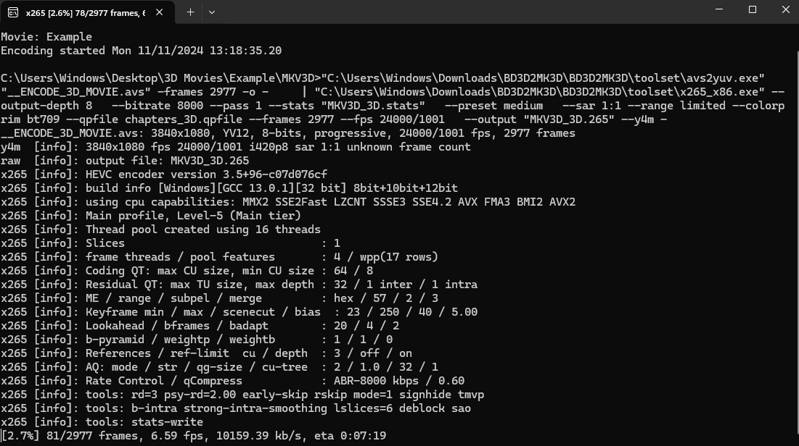

# 3D Bluray Guide

Table of Context

[Required Downloads](https://the-sundance-kid.github.io/3D-isnt-Dead-Test/Guide.html#required-downloads) - [Bluray Ripping Setup](https://the-sundance-kid.github.io/3D-isnt-Dead-Test/Guide.html#bluray-ripping-setup) - [Bluray Ripping Process](https://the-sundance-kid.github.io/3D-isnt-Dead-Test/Guide.html#bluray-ripping-process) - [Completing The Rip](https://the-sundance-kid.github.io/3D-isnt-Dead-Test/Guide.html#complete-the-rip) - [File Conversion Setup](https://the-sundance-kid.github.io/3D-isnt-Dead-Test/Guide.html#file-conversion-setup) - [Adding Additional Info To The Conversion](https://the-sundance-kid.github.io/3D-isnt-Dead-Test/Guide.html#adding-additional-info-to-the-conversion) - [The Conversion Process](https://the-sundance-kid.github.io/3D-isnt-Dead-Test/Guide.html#the-conversion-process)

## Prerequisites:

* A Bluray player attached to a Windows PC. The Bluray player may need to be patched.
* Please research if your Bluray player is ripping compatible. Elements of this tutorial may not work if your Bluray player is not patched. 
* Helpful tutorials can be found online.

## Preliminaries:

* Since I do not want any trouble, elements of the tutorial will be blacked out so I do not face any legal trouble. 
* This is for archival or personal use only. Any trouble with the law is not my fault and your decisions are of yours alone.
* The red arrows on the screenshots are not part of the software, but added on top for extra direction.
* Proceed at your own risk.

## Requirements:
* Microsoft Windows
* A Bluray drive

## For archivists:
* Some steps will have a subset labelled (A) for Archivists. These subsets will have addition information for archivists to possibly use.

## Required Downloads:

* Download - [AviSynth](https://github.com/AviSynth/AviSynthPlus/releases/download/v3.7.3/AviSynthPlus_3.7.3_20230715.exe)
* Download - [MakeMKV](https://www.makemkv.com/download/Setup_MakeMKV_v1.17.8.exe)
* Download - [BD3D2MK3D](https://www.videohelp.com/download/BD3D2MK3D.7z?r=CmFGdbFKDb)

## Bluray Ripping Setup:

* Insert your Bluray into into your drive and run MakeMKV. 
* The program should recognize the Bluray and should look like this. 
* Click on the big Bluray disk icon.

## Bluray Ripping Setup (A):
* For an achivist I would recommend opening a text editor where you can copy the text that will come up at the bottom of the MakeMKV program.

## Bluray Ripping Process:

* Once you have clicked on the icon the software will start detecting what is on the disk. 
* Once it is finished detecting what is on the disk it should look somewhat like this. 

* It is very important to remember that 3D Blurays are encoded as AVC/MVC so that is the file type we are looking for. 
* Having reached this point there are a few options. Since there can be many videos on the Bluray you need to figure out which file you want. 
* You can see all the files on the Bluray on the left. 
* You want to find the file that is encoded as AVC/MVC and select the Video box if it has not been already. 
* Clicking on a file will tell you how long it is, and that is usually the best way to find what file you are looking for. 
* You can also use the drop down option to add different audio tracks and subtitles if you wish. 
* On the right you can change the file name and file location. 
* Once you have picked what you want, click the Make MKV icon on the top right. 

## Completing The Rip:

* Once the ripping is done it should look somewhat like this. It could take a while depending on how big the file is. 

(I chose a smaller file just to expedite the process of making this tutorial)

Congrats! You just finished the first half. 

## File Conversion Setup:

* Open BD3D2MK3D. 
* Say okay to any warnings that may come up, and you should see something like this. 

* From here click on “Switch to 3D MKV” mode on the top right. It should then look like this. 

* Now click on the “Open 3D MKV created by MakeMKV” on the left. 
* Then navigate to where you created the MKV file with MakeMKV. 
* Once the file has been loaded in it should look something like this. 

* There are a lot more options here than in MakeMKV. 

## Adding Additional Info To The Conversion:

* Go through the tabs at the top of the program. 
* In tab 3 it is mandatory that you create a file name. 
* For an archive I would recommend filling in as many of the tags as possible. 
* The most crucial tab is tab 5. 

* Seen here is tab 5. I uncheck stereoscopy to get full side-by-side renders, but a warning will come up explaining why you may not want to use this option. 
* Then under “X265 (h265 HEVC) encoder options”, click on the drop down menu and select “2-pass”. 
* Under that is the presets. The slower the preset the higher quality the outcome will be. 
* However, some of the slower presets can take days. It is up to you as an archivist to determine what works best for your archive. 
* Also you should match the “Colour depth” to whatever the colour depth is of the file if you can find that out. 
* Finally, set your file destination, and click “Do it!”. 

## Adding Additional Info To The Conversion (A):
* To make sure the toggles match the video file you have just ripped, a software like MediaInfo will let you know the bitrate of the video and any other information you might like to know. For an archivist you want as much of the data to be the same.

## The Conversion Process:

* Once you have clicked “Do it!” several things will happen. Just let it do its thing. 
* Normally it should do it all but occasionally you could be prompted with something like this. 

* Hit okay and navigate to where your file destination is. In that directory there will be a bunch of files.
* Find that "_ENCODE_3D_LAUNCHER.cmd" and double click it. A CMD window will pop up looking like this. 
* Just let it do its thing. It could take a while. 

* Since it is working for both eyes it will take double the amount of time. 
* Once done the CMD should look something like this.

* In the same folder you should be able to find your new converted SBS 3D video. 
* All the other files can be deleted if you wish.

## The Conversion Process (A):
* The extra files can be useful for archival purposes

  IMAGE

* Here we can see all sorts of informative files. BD3D2MK3D.txt is a log of what transpired during the encoding process. There are also files displaying the tags and the metadata of the video file you have just made. Keeping these in a subfolder could benefit long term preservation and understand of the video file.

Go back to the [Homepage](index.md)
